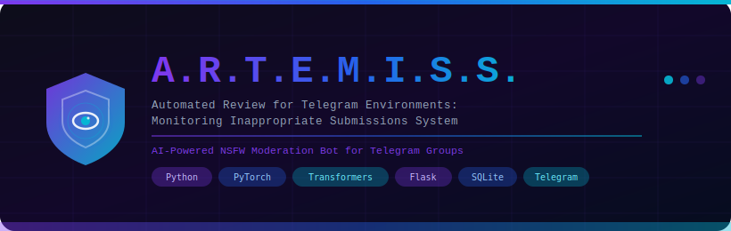
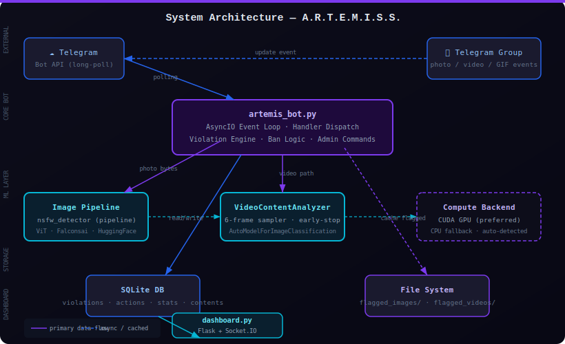
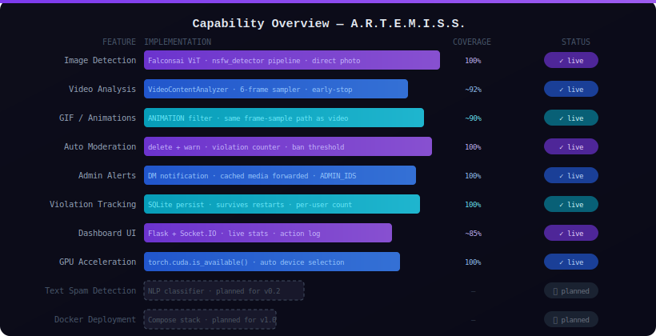
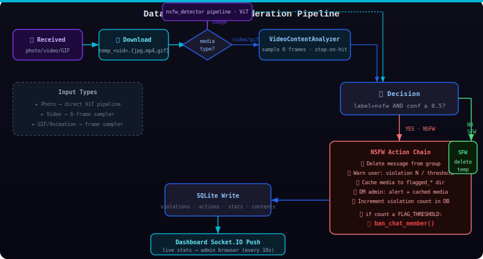
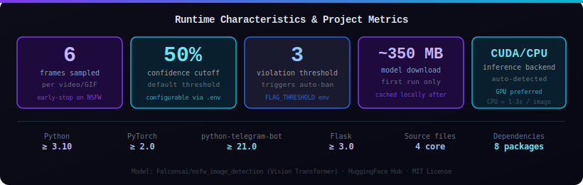

<div align="center">



</div>

**Your Telegram group's immune system — because human moderators sleep and NSFW content doesn't.**

[Features](#-features) • [Installation](#-installation) • [Usage](#-usage) • [Architecture](#-architecture) • [Roadmap](#-roadmap) • [License](#-license)

---

*I built this because I was tired of being the person who had to click "delete" at 2 AM. A Vision Transformer can do the same job faster, without burnout, and without needing a salary. A.R.T.E.M.I.S.S. is the result of pointing modern AI at the oldest problem in online community management.*

A.R.T.E.M.I.S.S. (**A**utomated **R**eview for **T**elegram **E**nvironments: **M**onitoring **I**nappropriate **S**ubmissions **S**ystem) is a Python bot that watches every photo, video, and GIF posted to your Telegram groups, runs it through the [Falconsai](https://huggingface.co/Falconsai/nsfw_image_detection) Vision Transformer model, and acts on the result before a human even sees it. Flagged content is deleted instantly, the sender gets a warning, repeat offenders get banned automatically, and every admin gets a DM with the cached evidence. The whole thing persists state in SQLite, runs on CPU or CUDA, and ships a real-time Flask dashboard so you can watch the violation count tick up in peace.

---

<div align="center">


</div>

---

## 🧠 System Overview

A.R.T.E.M.I.S.S. is a server-side Python process that long-polls the Telegram Bot API, intercepts media events, downloads them to a temp file, runs inference through a ViT classification model, and applies a deterministic action chain based on the result. There are no threads — it's a single AsyncIO event loop handled by `python-telegram-bot`. The ML model is loaded once at startup as a module-level singleton and reused for every message, keeping memory overhead predictable.

```
A.R.T.E.M.I.S.S/
├── artemis_bot.py        # Core process: event loop, all handlers, violation engine
├── dashboard.py          # Separate Flask process: admin web UI + Socket.IO
├── setup_db.py           # One-time DB initialization
├── templates/index.html  # Dashboard frontend
├── requirements.txt      # 8 Python dependencies
├── .env.example          # Config template
└── wiki/                 # Extended documentation
```

The architecture is deliberately flat — one bot process, one dashboard process, one SQLite file. No message queues, no microservices, no ops overhead.

<div align="center">



</div>

---

## ⚡ Features

| Feature | What it actually does |
|---|---|
| 🖼️ **Image NSFW Detection** | Downloads the photo to a temp file and runs it through the Falconsai ViT pipeline; returns a label and confidence score |
| 🎬 **Video Frame Analysis** | Seeks to 6 evenly-spaced positions in the video, extracts frames via OpenCV, and stops as soon as one frame exceeds the NSFW threshold |
| 🎭 **GIF / Animation Support** | Telegram sends GIFs as `Animation` objects; the bot routes these through the same frame-sampling path as MP4 video |
| 🗑️ **Instant Message Deletion** | Calls `bot.delete_message()` before replying, so the NSFW content disappears from the group as fast as Telegram's API allows |
| 📊 **Violation Tracking** | Writes per-user counts to SQLite's `violations` table; reads it back on every action; survives process restarts |
| 🔨 **Auto-Ban System** | When violation count reaches `FLAG_THRESHOLD`, calls `ban_chat_member()` and resets the counter; skips ban in private chats, handles the can't-remove-owner edge case |
| 👮 **Admin Notifications** | Iterates `ADMIN_IDS`, sends a text alert and then the cached flagged file (photo or video) to each admin's DM |
| 🗃️ **Media Caching** | Renames the temp file to `flagged_images/user_{id}_{timestamp}.jpg` or `flagged_videos/user_{id}_{timestamp}.mp4` before forwarding to admins |
| 🖥️ **Real-time Dashboard** | Flask serves `templates/index.html`; Socket.IO pushes fresh stats from SQLite every 10 seconds without a page refresh |
| 🛠️ **Admin Commands** | `/admin_flagged` lists all users with violations; `/admin_reset <id>` zeroes a user's count; `/admin_ban <id>` manually bans |
| 📈 **Stats Command** | `/stats` returns totals for: scanned, NSFW detected, SFW, banned, violations — sourced from the `stats` table |
| 🐳 **GPU Acceleration** | Checks `torch.cuda.is_available()` at startup; loads both the image pipeline and the video analyzer onto the detected device |
| ⚙️ **Env-based Config** | Every operational parameter (`BOT_TOKEN`, `ADMIN_IDS`, `FLAG_THRESHOLD`, `DB_FILE`, cache dirs) is read from `.env` with sensible defaults |

---

## 🗺️ Capability Visualization

<div align="center">



</div>

---

## 🏗️ Architecture

<div align="center">


</div>

The bot runs as a single process under `asyncio`. `python-telegram-bot`'s `ApplicationBuilder` wires up command and message handlers, then calls `run_polling()` which drives the event loop indefinitely. There is no parallelism — each incoming update is processed sequentially in the same coroutine, which means a slow video inference blocks the next message. This is a deliberate trade-off: it keeps the code simple, predictable, and debuggable, and for the typical Telegram group the rate of incoming media is low enough that the queue never backs up meaningfully.

The ML layer is split into two components: a `pipeline()` call for images (which handles preprocessing internally) and a `VideoContentAnalyzer` class for video/GIF (which owns the `AutoModelForImageClassification` instance and a `ViTImageProcessor`). Both are initialized at module load time as singletons, so model weights are loaded once regardless of how many messages arrive. The `VideoContentAnalyzer.analyze_video()` method uses OpenCV to seek frames and PIL to convert them before passing to the ViT model; it returns early if any frame crosses the NSFW threshold with `stop_on_nsfw=True`.

---

## 🌊 Data Flow

<div align="center">



</div>

Primary data path for a photo message:

```
Telegram API  →  handle_image()  →  download to temp_{uid}.jpg
                                  →  nsfw_detector(temp_path)
                                  →  label == "nsfw" AND score ≥ 0.5?
                                     YES → delete_message()
                                          → add_violation() → violations.db
                                          → rename to flagged_images/
                                          → send_message(warn) → group
                                          → send_message(alert) + send_photo → admin DMs
                                          → violation_count ≥ FLAG_THRESHOLD?
                                             YES → ban_chat_member()
                                     NO  → os.remove(temp_path)
```

---

## 🔧 Installation

### Prerequisites

- Python 3.10 or newer (3.11 recommended)
- A Telegram bot token from [@BotFather](https://t.me/BotFather)
- At least one admin Telegram user ID (get yours via [@userinfobot](https://t.me/userinfobot))
- 500 MB free disk for the model cache — it downloads ~350 MB on first run

> **Why PyTorch?** The Falconsai model is distributed as a HuggingFace `transformers` checkpoint, which requires PyTorch as the computation backend. There is no lighter alternative that uses the same model format.

> **Why OpenCV?** `opencv-python-headless` provides reliable video frame seeking (`CAP_PROP_POS_FRAMES`) without requiring a display server. The headless variant skips the GUI libraries, which matters in a server environment.

### Steps

1. **Clone the repository**

   ```bash
   git clone https://github.com/Kaelith69/A.R.T.E.M.I.S.S.git
   cd A.R.T.E.M.I.S.S
   ```

2. **Create and activate a virtual environment** — skipping this will pollute your system Python and you will regret it

   ```bash
   python -m venv venv
   source venv/bin/activate        # Windows: venv\Scripts\activate
   ```

3. **Install dependencies**

   ```bash
   pip install -r requirements.txt
   ```

4. **Configure the bot**

   ```bash
   cp .env.example .env
   # Open .env and set at minimum: BOT_TOKEN and ADMIN_IDS
   ```

5. **Initialize the database**

   ```bash
   python setup_db.py
   ```

6. **Start the bot**

   ```bash
   python artemis_bot.py
   ```

7. **(Optional) Start the dashboard** in a second terminal

   ```bash
   python dashboard.py
   # Then open http://localhost:5000
   ```

> 💡 **First run tip:** The Falconsai model (~350 MB) downloads from HuggingFace on startup and caches in `~/.cache/huggingface/`. Subsequent starts are instant. If you're on a metered connection, pre-download with `python -c "from transformers import pipeline; pipeline('image-classification', model='Falconsai/nsfw_image_detection')"`.

### Environment Variables

| Variable | Required | Default | Description |
|---|---|---|---|
| `BOT_TOKEN` | ✅ | — | Telegram bot token from BotFather |
| `ADMIN_IDS` | ✅ | — | Comma-separated Telegram user IDs who receive alerts |
| `FLAG_THRESHOLD` | ❌ | `3` | Number of violations before auto-ban triggers |
| `DB_FILE` | ❌ | `violations.db` | Path to the SQLite database file |
| `FLAGGED_IMAGES_DIR` | ❌ | `flagged_images` | Directory for cached flagged images |
| `FLAGGED_VIDEOS_DIR` | ❌ | `flagged_videos` | Directory for cached flagged videos |
| `DASHBOARD_SECRET_KEY` | ❌ | auto-generated | Flask session secret; set a stable value for persistent sessions |

### Platform Notes

| Platform | Notes |
|---|---|
| Linux (x86_64) | Full support. CUDA works if drivers are present. |
| macOS (Apple Silicon) | Works on CPU. PyTorch MPS backend available but not tested. |
| Windows | Works on CPU. CUDA works with appropriate drivers. Use `venv\Scripts\activate`. |
| Docker | No official image yet — planned for v1.0. The bot has no persistent state outside `DB_FILE` and the cache dirs, so containerizing is straightforward. |

---

## 🚀 Usage

### Adding the Bot to a Group

1. Search for your bot in Telegram by username and add it to the target group
2. Promote the bot to **admin** with at minimum:
   - **Delete messages** — without this, the bot cannot remove NSFW content
   - **Ban users** — without this, the auto-ban feature silently fails
3. Send `/start` in the group to confirm the bot is responding

### Commands

| Command | Who | What it does |
|---|---|---|
| `/start` | Anyone | Sends a welcome message explaining the bot |
| `/help` | Anyone | Full command reference with usage examples |
| `/violations` | Anyone | Reports the caller's current violation count |
| `/stats` | Anyone | Prints aggregate stats: scanned, NSFW, SFW, banned, total violations |
| `/admin_flagged` | Admins only | Lists every user in the DB with a violation count > 0 |
| `/admin_reset <user_id>` | Admins only | Resets a specific user's violation count to 0 |
| `/admin_ban <user_id>` | Admins only | Manually bans a user from the current chat |

### Dashboard

```bash
python dashboard.py
```

Navigate to `http://localhost:5000`. The dashboard surfaces:
- **Stats panel** — scanned, NSFW, SFW, banned totals
- **Action log** — timestamped record of every deletion and ban
- **Content type breakdown** — image vs. video split
- **Live updates** — Socket.IO pushes fresh data every 10 seconds

> 💡 **Pro tip:** The dashboard has no authentication. It's safe on localhost, but if you expose it remotely, put it behind a reverse proxy with HTTP basic auth. The `DASHBOARD_SECRET_KEY` only protects Flask sessions, not dashboard access.

---

## 📁 Project Structure

```
A.R.T.E.M.I.S.S/
├── artemis_bot.py        # 🤖 Core bot — AsyncIO event loop, all message/command handlers,
│                         #    ML inference calls, violation logic, ban engine
├── dashboard.py          # 📊 Admin dashboard — Flask app + Socket.IO background thread,
│                         #    3 REST endpoints (/api/stats, /api/actions, /api/all_data)
├── setup_db.py           # 🗄️ One-time DB setup — creates violations, stats, actions, contents tables
├── templates/
│   └── index.html        # 🖥️ Dashboard UI — Tailwind CSS + Chart.js + Socket.IO client
├── assets/               # 🎨 SVG assets + demo GIF
│   ├── hero-banner.svg
│   ├── architecture.svg
│   ├── data-flow.svg
│   ├── capabilities.svg
│   └── stats.svg
├── wiki/                 # 📚 Extended docs (Architecture, Usage, Privacy, Roadmap, etc.)
├── blueprint.md          # 🗺️ Original development timeline and module specs
├── .env.example          # ⚙️ Config template — copy to .env, never commit the actual .env
├── requirements.txt      # 📦 8 Python dependencies
├── CONTRIBUTING.md       # 🤝 Contribution guidelines
├── SECURITY.md           # 🔐 Security policy
└── LICENSE               # ⚖️ MIT License

# Created at runtime (not committed):
├── violations.db         # SQLite database
├── flagged_images/       # Cached flagged images (user_{id}_{timestamp}.jpg)
├── flagged_videos/       # Cached flagged videos/GIFs (user_{id}_{timestamp}.{mp4,gif})
└── temp_<user_id>.*      # Ephemeral temp files — deleted immediately after scan
```

---

## 📈 Performance Stats

<div align="center">



</div>

---

## 🔒 Privacy

A.R.T.E.M.I.S.S. runs entirely on your own server. No data leaves your machine except back to the Telegram API.

- **Flagged media** is cached locally in `flagged_images/` and `flagged_videos/` for admin review; you control retention
- **SFW media** is deleted from disk immediately after the classifier returns a clean result
- **Violation records** store only Telegram user IDs (integers) and counts — no names, no usernames, no message content
- **The Falconsai model** runs locally after the one-time download; no inference calls are made to external APIs
- **No analytics, no telemetry, no callbacks** — the only outbound traffic is to `api.telegram.org`
- **The dashboard** serves data from local SQLite only; it has no external data sources

See [SECURITY.md](SECURITY.md) and [wiki/Privacy.md](wiki/Privacy.md) for the complete picture.

---

## 🗺️ Roadmap

**v0.2 — Detection Expansion**
- [ ] Text spam detection via NLP classifier
- [ ] Configurable ban escalation: mute → kick → ban with increasing durations
- [ ] Sticker and document NSFW detection

**v0.3 — Multi-Group Support**
- [ ] Per-group configuration (separate thresholds, separate admin sets)
- [ ] Dashboard authentication (currently open — LAN-only by default)
- [ ] Webhook mode as an alternative to long-polling

**v0.4 — Operations**
- [ ] Rate limiting and flood protection
- [ ] Structured logging (JSON) for log aggregators
- [ ] Configurable NSFW confidence threshold per group

**v1.0 — Production Ready**
- [ ] Docker Compose deployment (bot + dashboard + SQLite volume)
- [ ] Health-check endpoint for uptime monitoring
- [ ] Graceful shutdown handling

See [wiki/Roadmap.md](wiki/Roadmap.md) for more detail and rationale.

---

## 📦 Packaging

There is no pre-built binary or PyPI package. To run A.R.T.E.M.I.S.S. as a standalone service, use a process manager:

```bash
# systemd unit (Linux)
[Unit]
Description=A.R.T.E.M.I.S.S. Telegram Bot
After=network.target

[Service]
WorkingDirectory=/opt/artemiss
ExecStart=/opt/artemiss/venv/bin/python artemis_bot.py
EnvironmentFile=/opt/artemiss/.env
Restart=on-failure
RestartSec=5

[Install]
WantedBy=multi-user.target
```

```bash
# pm2 (cross-platform)
pm2 start artemis_bot.py --interpreter python3 --name artemiss
pm2 start dashboard.py   --interpreter python3 --name artemiss-dash
pm2 save
```

---

## 🤝 Contributing

Bug reports, feature requests, and PRs are welcome. See [CONTRIBUTING.md](CONTRIBUTING.md) for the workflow and code style expectations.

---

## 🔐 Security

For vulnerability reports, please follow the responsible disclosure process in [SECURITY.md](SECURITY.md). Don't open a public issue for security bugs.

---

## ⚖️ License

MIT License — see [LICENSE](LICENSE) for the full text.

Copyright © 2025 [Kaelith69](https://github.com/Kaelith69)

---

<div align="center">

*Made with too much caffeine and a principled objection to unsolicited NSFW content in group chats.*

</div>
